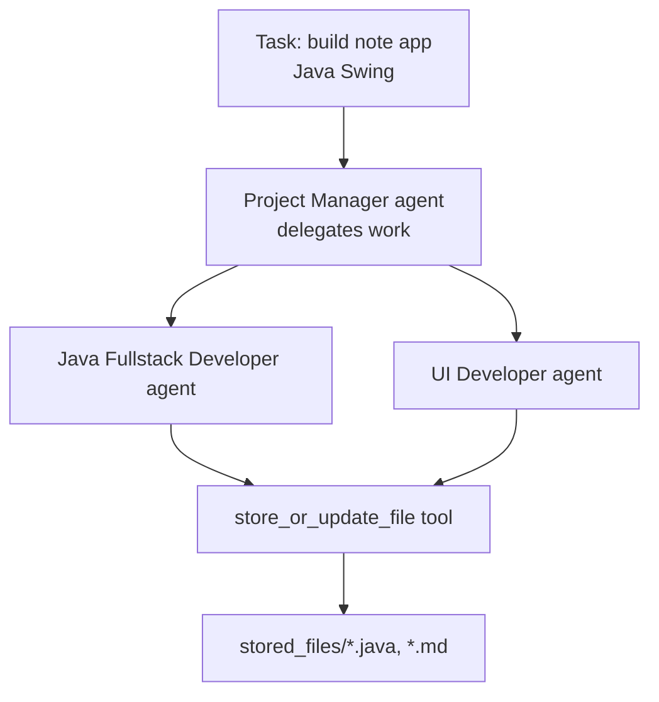

# AI-Code-Writer

CrewAI experiment where a simulated dev team — a Project Manager, a Java Fullstack Developer, and a UI Developer, all backed by a local Ollama model — collaborates to write a small Java Swing note-taking app, with the developer able to save its generated code straight to disk.

## How it works

`Agents.py` defines three agents with detailed role/backstory prompts and one task ("write a simple note app with Java Swing"), assigned to the Project Manager agent with delegation enabled — so the PM can hand off implementation work to `shubham` (the Java developer) and `bane` (the UI developer). Both developer agents are equipped with a custom `store_or_update_file` tool that writes (or appends to) files under `stored_files/`, which is how the generated Java source, tests, and design notes actually land on disk. A sequential `Crew` runs the task and prints the final result.



## Architecture

| File | Role |
|---|---|
| `Agents.py` | Defines the PM/developer/QA agents, the custom file-writing tool, and runs the crew |
| `stored_files/` | Output directory — generated Java source, tests, and design/review notes land here |

## Tech stack

CrewAI · LangChain (`langchain_ollama`) · Ollama (local LLM)

## Setup

```bash
pip install crewai crewai_tools langchain_ollama requests beautifulsoup4
ollama pull llama3.1
ollama serve
python Agents.py
```
